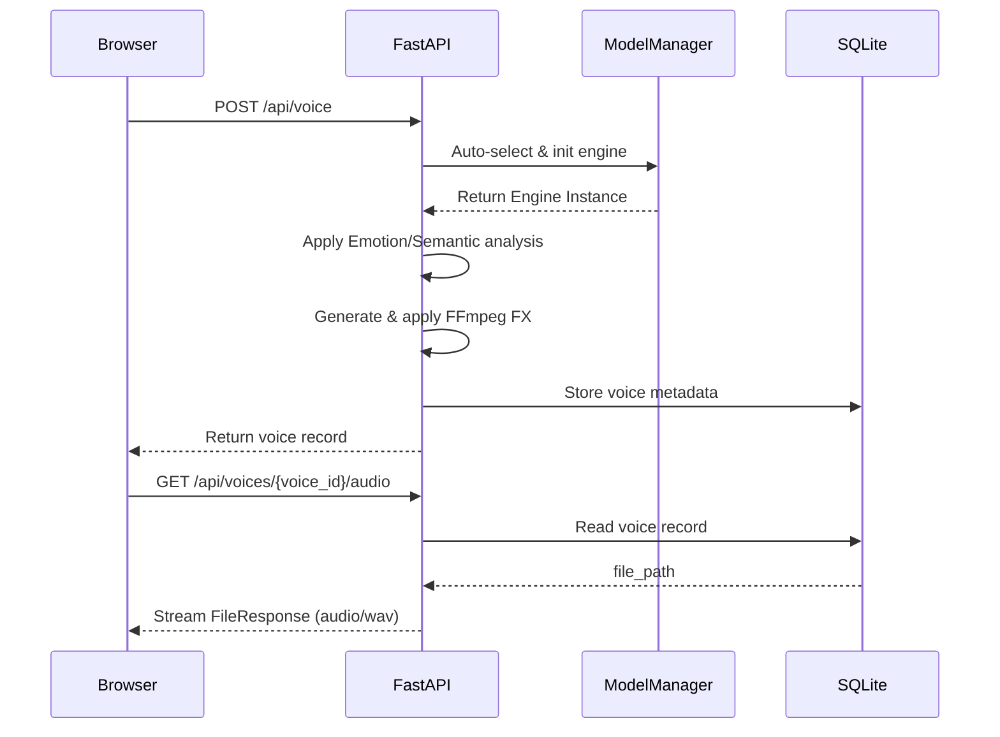
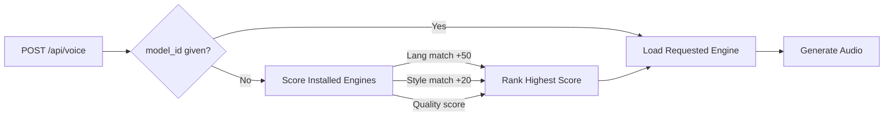

# TTS Chaos — Runtime and Deployment Pipeline

This document captures the current request flow, startup behavior, storage model, and deployment posture of the repository as it exists today.

---

## 1. Main request lifecycle



---

## 2. Startup and lifespan sequence

```text
uvicorn backend.app.main:app --host ${HOST} --port ${PORT}
  │
  ▼
FastAPI lifespan hook
  │
  ├─ Initialize the SQLite database (`voices.db`)
  ├─ Register the voice API router
  ├─ Register the model API router
  ├─ Mount the frontend static assets
  └─ Expose a health endpoint and a system-info endpoint
```

Important runtime defaults now come from environment variables:

- `HOST`
- `PORT`
- `ENABLE_DOCS`
- `CORS_ORIGINS`

This is the production-facing shape the repo now depends on.

---

## 3. Model selection path



If there is no installed model available, the default fallback is `edge-tts`.

---

## 4. Download pipeline

```text
POST /api/models/download/{model_id}
  │
  ├─ Validate that the catalog entry exists
  ├─ Reject duplicate work if the model is already installed
  └─ Start background download work with `asyncio.create_task(...)`

Background task
  │
  ├─ Resolve the URL(s) for the requested model payload
  ├─ Stream file chunks with `httpx.AsyncClient`
  ├─ Persist them to `models/<engine>/<model_id>/`
  ├─ Push progress events into an in-memory queue
  └─ Mark the model available once the stream is complete
```

Browser progress is consumed by the SSE endpoint at:

- `/api/models/download/{model_id}/progress`

---

## 5. Document and batch generation flow

```text
POST /api/voice/document
  │
  ├─ Read uploaded document content
  ├─ Parse it into text via `document_parser.py`
  ├─ Queue a background document job
  └─ Return `job_id`

Background batch job
  │
  ├─ Chunk text into manageable units
  ├─ Create one WAV asset per chunk
  ├─ Merge chunks with ffmpeg
  ├─ Save the merged asset to disk
  └─ Record the final voice file in the `voices` table
```

The document workflow is present in the API surface, but it remains a queue-based MVP and should continue to be treated as an operationally sensitive background task.

---

## 6. Storage model

The persistent voice metadata currently uses SQLite via `aiosqlite`.

```sql
CREATE TABLE IF NOT EXISTS voices (
    id TEXT PRIMARY KEY,
    voice_name TEXT NOT NULL,
    language TEXT NOT NULL DEFAULT 'en',
    style TEXT NOT NULL DEFAULT 'neutral',
    text TEXT NOT NULL,
    model_id TEXT NOT NULL,
    voice_id TEXT,
    speed REAL NOT NULL DEFAULT 1.0,
    pitch REAL NOT NULL DEFAULT 0.0,
    file_path TEXT NOT NULL,
    file_size INTEGER,
    duration_sec REAL,
    output_format TEXT NOT NULL DEFAULT 'wav',
    created_at TEXT NOT NULL
);
```

The DB file is kept under:

- `backend/app/data/voices.db`

---

## 7. Docker deployment posture

```text
docker compose up --build -d
  │
  ├─ Build the image from the repo root
  ├─ Expose port `2002`
  ├─ Mount model and audio volumes
  └─ Start the app through the environment-aware uvicorn command
```

This is the preferred self-hosted deployment shape.

---

## 8. Failure modes to keep in mind

- Missing optional engine dependencies can make a model unavailable even if it is in the catalog.
- Local downloaded model assets are not automatically validated beyond availability checks.
- Batch/document jobs run as background tasks and depend on stable FFmpeg and file-system permissions.
- Production defaults are now safer, but the repo still expects a controlled network and storage environment for large downloads.

---

## 9. Current maintainer guidance

If someone is returning to the codebase later, the most important places to read first are:

1. [backend/app/main.py](../backend/app/main.py) for runtime startup and middleware
2. [backend/app/api/routes.py](../backend/app/api/routes.py) for the voice and document API surface
3. [backend/app/api/models_router.py](../backend/app/api/models_router.py) for catalog and download behavior
4. [backend/app/db/store.py](../backend/app/db/store.py) for persistence shape
5. [backend/app/services/model_manager.py](../backend/app/services/model_manager.py) for model discovery and lifecycle

That combination will give a maintainer the fastest “how the system boots and serves requests” mental model.

